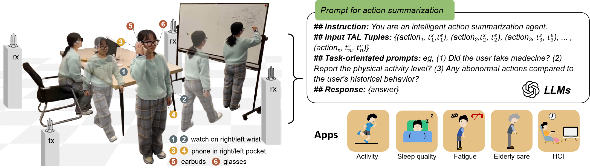

# XRFV2

<p align="center">
  
</p>


**XRF V2: A Dataset for Action Summarization with Wi-Fi Signals, and IMUs in Phones, Watches, Earbuds, and Glasses**

XRF V2 is a dataset designed for action summarization tasks using Wi-Fi signals and IMUs data from various devices such as phones, watches, earbuds, and glasses. This dataset provides valuable insights into human activity recognition and summarization using multi-modal sensor data.

**📊 Download Link**: 
-   Kaggle (IMU and Wi-Fi: ): https://www.kaggle.com/datasets/anonymous20251/xrfv2dataset
-   SDP  (IMU, Wi-Fi): http://www.sdp8.org/Dataset?id=1186880c-b321-45d0-ac3a-74ef9d2fdeda

- Models' weights: https://drive.google.com/drive/folders/1N3Ytqp0UjiBdSc_rb3kPjjwejmdtZEK1?usp=sharing


## 📦 Environment Configuration

### 🛠️ Mamba Environment Setup:
Ensure that you are using the **CUDA 11.8** environment.

```bash
# Clone the video-mamba-suite repository
git clone --recursive https://github.com/OpenGVLab/video-mamba-suite.git

# Create and activate the environment
conda create -n video-mamba-suite python=3.9
conda activate video-mamba-suite

# Install PyTorch
pip install torch==2.1.2 torchvision==0.16.2 torchaudio==2.1.2 --index-url https://download.pytorch.org/whl/cu118

# Install required dependencies
pip install h5py pandas scipy torchinfo

# Install the requirements from requirement.txt
pip install -r requirement.txt

# Install causal-conv1d
cd causal-conv1d
# If setup.py fails, run the following:
CAUSAL_CONV1D_FORCE_BUILD=TRUE pip install .
cd ..

# Install mamba
cd mamba
python setup.py develop
cd ..
```
⚠️ If you encounter issues while installing `causal-conv1d`, please refer to [this setup issue fix](https://github.com/state-spaces/mamba/issues/40#issuecomment-1849095898).

## 🏃‍♂️ Running the Code:

1. Modify the paths in `basic_config.json` to match your system setup.
2. To **train** the model:
```bash
   python script/train_run.py
```
3. To **test** the model:

Copy the path of the trained model and specify it in `test_run.py` before running the test:

```
   test_model_list = [XXXXX]
```

```bash
   python script/test_run.py
```
## 📞 Support
If you encounter any issues or need assistance, feel free to reach out to us.

## 📝 TODO
- To process video into 2D pose, 3D pose, and mesh for pose estimation and tracking, mesh reconstruction and tracking.
- To process video into internvideo6b features for multimodal learning.


## License 📜
XRFV2 is licensed under the MIT License. See the LICENSE file for more details.

## Citation
If XRFV2 helps in your research, please kindly cite 
```
@article{lan2025xrf,
  author = {Lan, Bo and Li, Pei and Yin, Jiaxi and Song, Yunpeng and Wang, Ge and Ding, Han and Han, Jinsong and Wang, Fei},
  title = {XRF V2: A Dataset for Action Summarization with Wi-Fi Signals, and IMUs in Phones, Watches, Earbuds, and Glasses},
  journal = {Proceedings of the ACM on Interactive, Mobile, Wearable and Ubiquitous Technologies},
  volume={9},
  number={3},
  year = {2025},
  publisher = {ACM}
}
```

